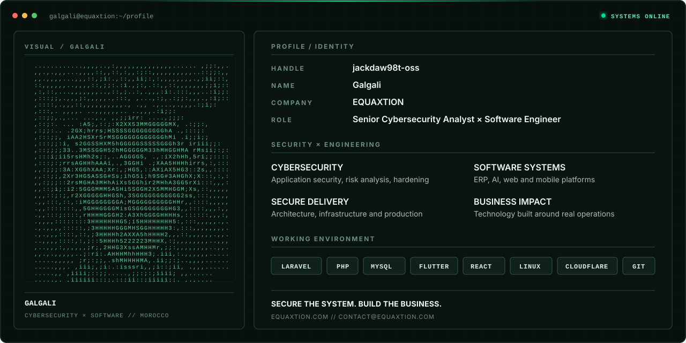

  <picture>
    <source media="(max-width: 600px)" srcset="./assets/equaxtion-cover-mobile.svg" />
    
  </picture>

  <strong><a href="https://equaxtion.com">equaxtion.com</a></strong>
  &nbsp;·&nbsp;
  <strong><a href="mailto:contact@equaxtion.com">contact@equaxtion.com</a></strong>
  &nbsp;·&nbsp;
  Morocco

## Secure technology. Built to move business forward.

**EQUAXTION is a Moroccan technology company** that designs, secures, and delivers digital systems for organizations that expect their technology to work — reliably, commercially, and under real operational pressure.

I am **Galgali**, a **Senior Cybersecurity Analyst & Software Engineer** at EQUAXTION. I combine security analysis with production engineering, so security is considered before deployment, architecture is shaped around risk, and development stays connected to the business outcome.

We work across cybersecurity analysis, secure architecture, application security, custom software, ERP and POS systems, AI automation, web platforms, mobile applications, dashboards, hardware integrations, and immersive digital experiences.

### Cybersecurity × engineering

**Security & resilience** — Risk analysis, application security, vulnerability assessment, system hardening, secure-by-design architecture, and technical investigation.

**Business software** — ERP, POS, inventory, finance, production, operations, analytics, and internal tools designed around real workflows.

**Digital products** — Commercial websites, e-commerce, portals, dashboards, kiosks, APIs, and mobile applications.

**Intelligent & immersive systems** — AI-enabled workflows, automation, analytics, 3D, AR/VR, digital twins, and connected experiences.

### Working environment

Laravel · PHP · MySQL · Flutter · React · Next.js · Node.js · Python · Linux · Windows · Cloudflare · Git · APIs · Hardware integrations

## Looking for the repositories?

No, GitHub is not buffering. Most of the serious work lives in **private repositories**.

Client ERP systems, security work, production infrastructure, and commercial platforms should not become public souvenirs. If you are evaluating EQUAXTION for a project, partnership, or technical mission, **ask me and I will show you the right work in the right context** — without opening every door. That would be terrible cybersecurity. 🙂

## Build it. Secure it. Make it useful.

Have a platform to launch, a business process to digitize, or a system that needs a serious security and engineering review?

**Website:** [equaxtion.com](https://equaxtion.com) 
**Business contact:** [contact@equaxtion.com](mailto:contact@equaxtion.com) 
**Based in:** Morocco

  EQUAXTION · Cybersecurity, software engineering, and digital systems.

