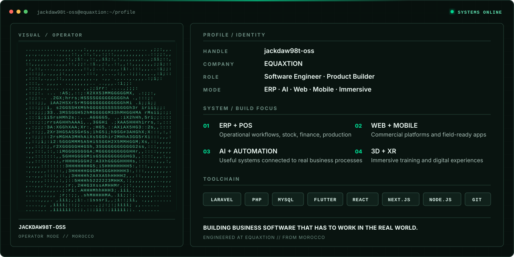

<div align="center">
  
</div>

<p align="center">
  <a href="https://equaxtion.com"></a>
  <a href="https://github.com/jackdaw98t-oss"></a>
  
</p>

## Systems, not demos.

I design and engineer software around real operations: stock that must reconcile, permissions that must hold, workflows that teams can actually use, and interfaces that stay clear under pressure. My work at **EQUAXTION** spans ERP, POS, web platforms, mobile apps, AI automation, dashboards, hardware integrations, and immersive experiences.

<table>
  <tr>
    <td width="50%" valign="top">
      <strong>Operational software</strong><br />
      ERP, POS, inventory, finance, production, restaurant, retail, and internal business tools.
    </td>
    <td width="50%" valign="top">
      <strong>Commercial platforms</strong><br />
      Distinctive websites, e-commerce, portals, dashboards, kiosks, and mobile experiences.
    </td>
  </tr>
  <tr>
    <td width="50%" valign="top">
      <strong>AI & automation</strong><br />
      Practical assistants, connected workflows, analytics, and task automation built around business value.
    </td>
    <td width="50%" valign="top">
      <strong>Immersive systems</strong><br />
      3D, AR/VR, digital twins, interactive training, and hardware-connected experiences.
    </td>
  </tr>
</table>

## Core toolchain

<p>
  
  
  
  
  
  
  
  
  
  
</p>

```text
01  Understand the business before touching the architecture.
02  Protect production data before optimizing delivery speed.
03  Make the interface operational before making it decorative.
04  Ship only what has been checked in the real workflow.
```

<p align="center">
  <sub>Designed and engineered in Morocco by EQUAXTION.</sub>
</p>
